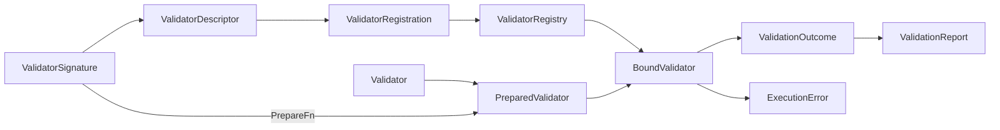

# qubit-validator Design

[简体中文](design.zh_CN.md)

Applies to `qubit-validator` 0.1.x · Minimum supported Rust: 1.94

## Goals and Non-Goals

The crate has four goals:

- keep validation rules type-safe and directly callable;
- support configured execution through a small, safe type-erased boundary;
- make registration deterministic and diagnosable; and
- represent violations, skips, binding failures, and execution failures as
  distinct public concepts without retaining rejected inputs.

It does not discover object properties, traverse object graphs, compile model
paths, schedule sets of validators, localize messages, or prescribe how an
application stores declarations. Those policies stay outside this crate.

## Four-Layer Boundary

1. **Typed declaration.** `Validator<T, C>` is the domain-facing contract. Its
   concrete input, context, and error types remain visible to direct callers.
2. **Preparation and binding.** `PreparedValidator` is the erased execution
   boundary. `ValidatorSignature` declares an accepted `InputType`, ordered
   dependency slots, and a preparation function. `ValidatorDescriptor` selects
   a signature and produces a `BoundValidator`.
3. **Registration and lookup.** `ValidatorRegistration` pairs a stable
   `ValidatorId` and static descriptor with a `RegistrationSource`.
   `ValidatorRegistry` freezes registrations, diagnoses conflicts, and supports
   lookup and binding.
4. **Execution and reporting.** A `BoundValidator` validates a borrowed
   `ValidationValue` against a `BoundValidationContext`, returning a
   `ValidationOutcome` or `ExecutionError`. Callers aggregate final violations
   and skipped occurrences in `ValidationReport`.

The layers depend inward through public contracts. In particular, the registry
does not inspect validator implementation types, and reports do not drive
execution.

## Declaration-to-Report Data Flow

A preparation function decodes `NamedValidationArgument` values and returns an
owned prepared instance. Binding selects one signature, validates the caller's
dependency declaration, and stores the selected input shape, dependency slots,
prepared instance, and rule ID in the bound validator. `BoundValidator::from_prepared<T>`
provides the same runtime input check for an already prepared rule with no dependencies. Execution checks the erased input and dependency
values before delegating to the prepared instance. The bound validator then
turns violation drafts into final violations by attaching its rule ID.

`ValidationReport` is downstream of execution: a caller decides occurrence
order, report limits, and whether to continue after an outcome or error. Its
only public aggregation entry point is `record_outcome`, which preserves
occurrence order and enforces the configured total failure and skip capacities.
The supplied occurrence path prefixes each retained invalid violation's relative path once.
Prerequisite evidence already carries an absolute path to its original failure and is
kept unchanged; the supplied path locates the skipped target. Prepared rules return
only `Valid` or `Invalid`; the caller constructs a skipped outcome when an input is
absent or a prerequisite failed. `ValidationReport::failures()` yields top-level
violations followed by prerequisite evidence in skipped-entry order. It preserves
duplicates, makes no global occurrence-order guarantee, and has the same item
count as `failure_count()`. Field path segments use static declared names; runtime
map positions use `MapEntry`.

## Descriptor, Signature, and Slot Invariants

- A descriptor must contain at least one signature.
- A descriptor cannot contain two signatures with the same input shape because
  input shape is the selection key.
- Each dependency name inside a signature is non-empty and unique.
- A caller's dependency declaration must contain exactly the selected
  signature's dependencies in the same order, with the same `InputType` and
  optional flag.
- A runtime `BoundValidationContext` must contain exactly one value per slot in
  the same order. A required slot cannot contain `ValidationValue::Missing`.
- When paths are supplied, the path slice and value slice have equal length.

Dependency order is an ABI-like contract. Although names appear in diagnostics,
execution reads dependencies by numeric slot. Reordering slots without changing
their names is therefore a breaking coordination change between declarations,
binding callers, and validator implementations.

`ValidatorDescriptor::try_new` validates a definition eagerly.
`ValidatorDescriptor::new` remains a const constructor; registry construction
and binding validate descriptors before use.

## One-Pass Parameter Consumption

`ArgumentReader` rejects duplicate names when it is created. Each present
parameter can then be consumed by one typed read. The read marks the parameter
consumed before decoding, so a type or range error cannot be bypassed by trying
a different reader afterward. A second read returns
`ParameterAlreadyConsumed`.

After extracting all supported parameters, a preparation function calls
`ArgumentReader::finish`. Any unconsumed value is reported as
`UnknownParameter`. Together, duplicate rejection, one-pass reads, and
`finish` make parameter handling explicit and deterministic.

## Error Classification

The API separates expected invalid data from failures of configuration or
execution:

- A typed validator returns its domain-specific error. An adapter mapper
  converts that error to a `ViolationDraft`.
- `BindError` represents invalid configuration: parameters, signature
  selection, rule lookup, or dependency declarations.
- `ValidatorRegistryError` represents duplicate IDs or invalid descriptors
  while a registry is frozen.
- `ValidationOutcome::Invalid` carries final `Violation` values and is a
  successful execution result, not an `ExecutionError`.
- `ValidationOutcome::Skipped` records deliberate non-execution with a
  `SkipReason` and the required prerequisite detail.
- `ExecutionError` represents erased-shape, dependency-value, external, or
  adapter-contract failures.
- `ValidationReport` aggregates violations and skips and records whether
  configured limits truncated collection. `failure_count()` includes both
  top-level violations and retained prerequisite evidence.

An invalid prepared outcome with no violation drafts is an adapter contract
failure. The skipped variants also have shape invariants: `MissingOptional`
does not carry prerequisite violations, while `FailedPrerequisite` carries at
least one.

## Paths and Redaction

`ValidationPath` stores structured `PathSegment` values. Field names and map
positions can be useful to a trusted presentation layer, but default formatting
is deliberately conservative: `Display` emits a placeholder and `Debug`
reports shape rather than field contents. A trusted caller explicitly chooses
`ValidationPath::render` when disclosure is appropriate.
`Field` and `with_field` accept `&'static str` so ordinary runtime keys cannot
be retained accidentally. This type does not prove where a static string came
from; callers must still use declared field names and represent runtime map
positions with `MapEntry`, which does not retain the key text.
`ValidationPath::concat` joins segment sequences without rendering or parsing
them. The occurrence path passed to `record_outcome` is the base for each invalid
violation path; a root violation path means the occurrence itself. Failed-prerequisite
evidence retains its absolute path.

`ValidationValue` is a borrowed view and redacts its contents in `Debug`.
`BindError` stores parameter or dependency names, not parameter values.
`ExecutionError` stores no source error, so lower-level errors must be handled
or logged at the trusted conversion boundary. Its public `Display` and `Debug`
formatting expose only structured safe metadata. Violation
parameters are restricted to the public `ViolationParam` vocabulary.

The original rejected input must never be copied into a violation, retained by
an execution error, or interpolated into public error formatting. Adapters map
domain errors to stable codes and presentation-safe parameters instead.

## Local and Inventory Feature Boundary

The default feature set is empty. Typed validation, adapters, descriptors,
registrations, and `ValidatorRegistry::from_registrations` are always
available. Local registries are explicit values, so they are deterministic,
easy to isolate in tests, and suitable for multiple rule sets in one process.

The `inventory` feature adds `register_validator!`, linked registration
factories, and the process-wide `ValidatorRegistry::try_global` and `global`
accessors. It changes discovery, not the validator, signature, binding, or
execution contracts. Code that does not need process-wide discovery should not
enable it.

## Threading and Ownership Assumptions

Validation is synchronous. Inputs, parameter strings, dependency values, and
contexts are borrowed for their calls; the crate does not clone or retain the
input value. A prepared validator is held as `Arc<dyn PreparedValidator>`, and
`PreparedValidator` requires `Send + Sync`. The supplied text and typed
adapters consequently require their validators, mapped errors, and mapper
closures to satisfy the documented thread-safety bounds.

A registry owns a sorted boxed slice of lightweight registration values and an
index by stable ID. Descriptors, signatures, dependency specifications, IDs,
and registration source strings used by registrations are static. A
`BoundValidator` owns an `Arc` to its prepared instance and copies its selected
static signature and rule ID, so it can be cloned without re-preparation.

The crate makes no asynchronous runtime assumptions and performs no internal
parallel scheduling.

## Evolution Rules

- Public enums intended to evolve are `#[non_exhaustive]`; downstream matches
  must retain a wildcard arm. New variants may be added in compatible releases.
- Stable validator IDs and violation codes are protocol identifiers. Change or
  remove them only with an explicit consumer migration.
- Treat signature input shapes and dependency slots as ABI-like contracts.
  Reordering, removing, or changing a slot requires coordinated versioning even
  when source code still compiles.
- Add new parameter kinds through the public argument vocabulary and typed
  reader methods while preserving duplicate detection, one-pass consumption,
  and unknown-parameter rejection.
- Extend adapters without weakening input checks, dependency checks, outcome
  invariants, or redaction guarantees.
- Keep optional discovery behind features. New discovery mechanisms must not
  make direct validation or local registries depend on global mutable state.
- Keep traversal and orchestration policies outside the crate unless a future
  public design establishes a separate boundary for them.
