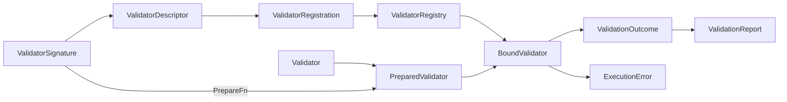

# qubit-validator Design

[简体中文](design.zh_CN.md)

Applies to `qubit-validator` 0.1.x · Minimum supported Rust: 1.94

## Goals and Non-Goals

The crate has four goals:

- keep validation rules type-safe and directly callable;
- support configured execution through a small, safe type-erased boundary;
- make registration deterministic and diagnosable; and
- represent violations, skips, binding failures, and execution failures as
  distinct public concepts without retaining rejected inputs.

It does not discover object properties, traverse object graphs, compile model
paths, schedule sets of validators, localize messages, or prescribe how an
application stores declarations. Those policies stay outside this crate.

## Four-Layer Boundary

1. **Typed declaration.** `Validator<T, C>` is the domain-facing contract. Its
   concrete input, context, and error types remain visible to direct callers.
2. **Preparation and binding.** `PreparedValidator` is the erased execution
   boundary. `ValidatorSignature` declares an accepted `InputType`, ordered
   dependency slots, and a preparation function. `ValidatorDescriptor` selects
   a signature and produces a `BoundValidator`.
3. **Registration and lookup.** `ValidatorRegistration` pairs a stable
   `ValidatorId` and static descriptor with a `RegistrationSource`.
   `ValidatorRegistry` freezes registrations, diagnoses conflicts, and supports
   lookup and binding.
4. **Execution and reporting.** A `BoundValidator` validates a borrowed
   `ValidationValue` against a `BoundValidationContext`, returning a
   `ValidationOutcome` or `ExecutionError`. Callers aggregate final violations
   and skipped occurrences in `ValidationReport`.

The layers depend inward through public contracts. In particular, the registry
does not inspect validator implementation types, and reports do not drive
execution.

## Declaration-to-Report Data Flow

```mermaid
flowchart LR
    V["Validator<T, C>"] --> P[PreparedValidator]
    S[ValidatorSignature] --> D[ValidatorDescriptor]
    S -- PrepareFn --> P
    D --> R[ValidatorRegistration]
    R --> G[ValidatorRegistry]
    G --> B[BoundValidator]
    P --> B
    B --> O[ValidationOutcome]
    B --> E[ExecutionError]
    O --> Q[ValidationReport]
```

A preparation function decodes `NamedValidationArgument` values provided by `qubit-validator` and returns an
owned prepared instance. Binding selects one signature and stores the selected
input shape, dependency slots,
prepared instance, and rule ID in the bound validator. `BoundValidator::try_from_prepared<T>` returns a binding error unless the prepared instance accepts exactly `T` and declares no dependencies. Every prepared instance reports its input and dependency shape; binding compares both against the selected static signature and attaches the rule ID to a mismatch. Execution checks the erased input and dependency
values before delegating to the prepared instance. The bound validator then
turns violation drafts into final violations by attaching its rule ID.

Descriptor binding attaches the requested rule ID to declaration, selection,
parameter, preparation, and prepared-shape errors, preserving each error's
kind and safe parameter or dependency metadata. Registry binding attaches
the registered rule ID to errors after lookup succeeds. If lookup fails with
`MissingRule`, no rule ID has been resolved, so `BindError::rule_id()` returns
`None`; the caller retains the requested ID text for its own diagnostics.

The `prepare_contextual_*_validator` adapters take the static dependency slice
as their first argument and map one domain error to one violation draft.
`prepare_text_domain_rule` and `prepare_typed_domain_rule` accept a typed
domain rule, dependency-aware invocation closure, and error mapper. The closure
returns infrastructure failures as `ExecutionError` and returns domain errors
as a separate result. The mapper converts each domain error to one or more safe
violation drafts; it cannot classify a failed domain result as valid.
Per-invocation metadata can be returned alongside the domain result for error
mapping. An empty draft list is
an adapter contract violation. The lower-level `prepare_text_with_context`
and `prepare_typed_with_context` adapters remain available when the closure
already constructs `PreparedOutcome`. Calls through `BoundValidator` pass
through its input, dependency, and rule-ID checks. Callers invoking a prepared
validator directly are responsible for supplying a context that meets its
declared contract.

`ValidationReport` is downstream of execution: callers choose occurrence order, report limits, and whether to continue. Successful `record_outcome` calls must use non-decreasing occurrence numbers; repeated numbers are allowed for multiple results at one position. A lower number returns `ValidationOutcomeError::OutOfOrderOccurrence` without changing the report. Results are appended in call order rather than sorted so previously issued `FailureId` indices remain stable. `record_outcome` returns a `RecordedOutcome` with completeness and the IDs of original failures retained from that occurrence. Failed-prerequisite skips refer to earlier failures with opaque `FailureId` values owned by the same report. The report validates ownership, existence, and uniqueness before mutation. References do not consume the violation limit; a failed-prerequisite skip still needs at least one already-retained reference, even when that limit is full. `failure_count()` and `failures()` count only original violations, and `failure(id)` resolves a reference. The skip limit applies only to skipped occurrences.

`ValidationLimits` bounds only retained violation and skipped-entry counts. It
does not bound input sizes, validation work, dependency path sizes, the number
of prerequisite references submitted at once, or memory already used to
construct an outcome. Applications enforce those resource limits at their
input and execution boundaries.

## Descriptor, Signature, and Slot Invariants

- A descriptor must contain at least one signature.
- A descriptor cannot contain two signatures with the same input shape because
  input shape is the selection key.
- A signature's input shape is its only selection key; the same input type
  cannot select different dependency specifications.
- Each dependency name inside a signature is non-empty and unique.
- The selected signature's dependency specifications are stored directly in the bound validator; callers do not echo them back to the registry. Model metadata validates actual dependency declarations.
- A runtime `BoundValidationContext` must contain exactly one value per slot in
  the same order. A required slot cannot contain `ValidationValue::Missing`.
- When paths are supplied, the path slice and value slice have equal length.

Dependency order is an ABI-like contract. Although names appear in diagnostics,
execution reads dependencies by numeric slot. Reordering slots without changing
their names is therefore a breaking coordination change between declarations,
binding callers, and validator implementations.

`ValidatorDescriptor::try_new` validates a definition eagerly.
`ValidatorDescriptor::new` remains a const constructor; registry construction
and binding validate descriptors before use.

## One-Pass Parameter Consumption

`ArgumentReader` rejects duplicate names when it is created. Each present
parameter can then be consumed by one typed read. The read marks the parameter
consumed before decoding, so a type or range error cannot be bypassed by trying
a different reader afterward. A second read returns
`ParameterAlreadyConsumed`.

After extracting all supported parameters, a preparation function calls
`ArgumentReader::finish`. Any unconsumed value is reported as
`UnknownParameter`. Together, duplicate rejection, one-pass reads, and
`finish` make parameter handling explicit and deterministic.

## Error Classification

The API separates expected invalid data from failures of configuration or
execution:

- A typed validator returns its domain-specific error. An adapter mapper
  converts that error to a `ViolationDraft`.
- `BindError` represents invalid configuration: parameters, signature
  selection, rule lookup, or dependency declarations.
- `ValidatorRegistryError` represents duplicate IDs or invalid descriptors
  while a registry is frozen.
- `ValidationOutcome::Invalid` carries final `Violation` values and is a
  successful execution result, not an `ExecutionError`.
- `ValidationOutcome::Skipped` records deliberate non-execution with a
  `SkipReason` and opaque IDs for earlier failures in the same report.
- `ExecutionError` represents erased-shape, dependency-value, external, or
  adapter-contract failures.
- `ValidationReport` aggregates violations and skips and records whether
  collection was incomplete. `is_truncated()` is true when configured limits
  reject records or when the caller stops validation early and calls
  `mark_truncated()`; it does not identify the reason. `failure_count()` equals
  the number of retained original violations; skips store IDs only.

An invalid prepared outcome with no violation drafts is an adapter contract
failure. The skipped variants also have shape invariants: `MissingOptional`
does not carry prerequisite violations, while `FailedPrerequisite` carries at
least one.

## Paths and Redaction

`ValidationPath` stores structured `PathSegment` values. Field names and map
positions can be useful to a trusted presentation layer, but default formatting
is deliberately conservative: `Display` emits a placeholder and `Debug`
reports shape rather than field contents. A trusted caller explicitly chooses
`ValidationPath::render` when disclosure is appropriate.
Simple ASCII identifiers retain dotted paths, while other field names render
as JSON-escaped `["..."]` segments. For example, `a.b` and `["a.b"]` denote
different structures.
`Field` and `with_field` accept `&'static str` so ordinary runtime keys cannot
be retained accidentally. This type does not prove where a static string came
from; callers must still use declared field names and represent runtime map
positions with `MapEntry`, which does not retain the key text.
`ValidationPath::concat` joins segment sequences without rendering or parsing
them. The occurrence path passed to `record_outcome` is the base for each invalid
violation path; a root violation path means the occurrence itself. Failed-prerequisite
evidence retains its absolute path.

`ValidationValue` and validation arguments are borrowed views and redact names and values in `Debug`.
`BindError` stores parameter or dependency names, not parameter values.
`ExecutionError` may retain an owned source for explicit trusted access through `trusted_source()`. Its public `Display`, `Debug`, and standard `Error::source()` do not expose the retained cause. Violation
parameters use the restricted public `ViolationParam` vocabulary, which limits
representation but does not prove provenance. `Unsigned(minimum)` from rule
configuration is allowed, while `Unsigned(rejected_number)` from rejected
input is not. A `Token`'s `'static` lifetime does not prove it came from a
trusted declaration. Callers must never include rejected input or sensitive
values derived from it.

The original rejected input must never be copied into a violation, retained by
an execution error, or interpolated into public error formatting. Adapters map
domain errors to stable codes and parameters whose content is chosen by the
caller to meet its disclosure policy.

## Local and Inventory Feature Boundary

The default feature set is empty. Typed validation, adapters, descriptors,
registrations, and `ValidatorRegistry::from_registrations` are always
available. Local registries are explicit values, so they are deterministic,
easy to isolate in tests, and suitable for multiple rule sets in one process.

The `inventory` feature adds `register_validator!`, linked registration
factories, and the process-wide `ValidatorRegistry::try_global` and `global`
accessors. It changes discovery, not the validator, signature, binding, or
execution contracts. Code that does not need process-wide discovery should not
enable it.

## Threading and Ownership Assumptions

Validation is synchronous. Inputs, parameter strings, dependency values, and
contexts are borrowed for their calls; the crate does not clone or retain the
input value. A prepared validator is held as `Arc<dyn PreparedValidator>`, and
`PreparedValidator` requires `Send + Sync`. The supplied text and typed
adapters consequently require their validators, mapped errors, and mapper
closures to satisfy the documented thread-safety bounds.

A registry owns one boxed slice of lightweight registration values sorted by
stable ID; lookup uses binary search. Descriptors, signatures, dependency specifications, IDs,
and registration source strings used by registrations are static. A
`BoundValidator` owns an `Arc` to its prepared instance and copies its selected
static signature and rule ID, so it can be cloned without re-preparation.

The crate makes no asynchronous runtime assumptions and performs no internal
parallel scheduling.

## Evolution Rules

- Public enums intended to evolve are `#[non_exhaustive]`; downstream matches
  must retain a wildcard arm. New variants may be added in compatible releases.
- Stable validator IDs and violation codes are protocol identifiers. Change or
  remove them only with an explicit consumer migration.
- Treat signature input shapes and dependency slots as ABI-like contracts.
  Reordering, removing, or changing a slot requires coordinated versioning even
  when source code still compiles.
- Add new parameter kinds through the public argument vocabulary and typed
  reader methods while preserving duplicate detection, one-pass consumption,
  and unknown-parameter rejection.
- Extend adapters without weakening input checks, dependency checks, outcome
  invariants, or redaction guarantees.
- Keep optional discovery behind features. New discovery mechanisms must not
  make direct validation or local registries depend on global mutable state.
- Keep traversal and orchestration policies outside the crate unless a future
  public design establishes a separate boundary for them.
