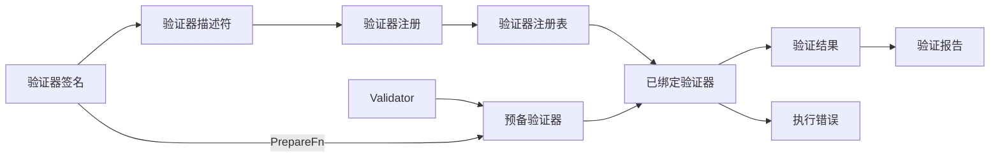

# qubit-validator 设计

[English](design.md)

适用版本：`qubit-validator` 0.1.x · 最低 Rust 版本：1.94

## 目标与非目标

本 crate 有四个目标：

- 让验证规则保持类型安全并可直接调用；
- 通过小型、安全的类型擦除边界支持配置化执行；
- 使注册过程确定且可诊断；
- 将违规项、跳过、绑定失败和执行错误表示为不同的公共概念，同时不保留被拒绝的输入。

本 crate 不发现对象属性、不遍历对象图、不编译模型路径、不调度验证器集合、不本地化消息，也不规定应用应如何存储声明。这些策略均位于本 crate 之外。

## 四层边界

1. **类型化声明。** `Validator<T, C>` 是面向领域的契约。直接调用方仍可看到具体的输入类型、上下文类型和错误类型。
2. **准备与绑定。** `PreparedValidator` 是类型擦除后的执行边界。`ValidatorSignature` 声明接受的 `InputType`、有序依赖槽位和准备函数。`ValidatorDescriptor` 选择一个签名并生成 `BoundValidator`。
3. **注册与查找。** `ValidatorRegistration` 把稳定的 `ValidatorId` 和静态描述符与 `RegistrationSource` 配对。`ValidatorRegistry` 冻结注册、诊断冲突，并支持查找和绑定。
4. **执行与报告。** `BoundValidator` 使用 `BoundValidationContext` 验证借用的 `ValidationValue`，返回 `ValidationOutcome` 或 `ExecutionError`。调用方将最终违规项与跳过记录汇总到 `ValidationReport`。

各层通过公共契约向内依赖。尤其是，注册表不会检查验证器的实现类型，报告也不会驱动执行。

## 从声明到报告的数据流

准备函数解码 `NamedValidationArgument` 值，并返回拥有所有权的预备实例。绑定过程选择一个签名、验证调用方的依赖声明，并在已绑定验证器中存储所选输入类型、依赖槽位、预备实例和规则 ID。`BoundValidator::from_prepared<T>` 为无依赖的已准备规则提供相同的运行时输入检查。执行过程先检查类型擦除后的输入和依赖值，再委托给预备实例。随后，已绑定验证器附加自己的规则 ID，把违规项草稿转换为最终违规项。

`ValidationReport` 位于执行的下游：调用方决定出现顺序、报告限制，以及得到验证结果或错误后是否继续。唯一公开的汇总入口是 `record_outcome`，它保留出现顺序并执行总失败数及跳过记录的容量限制。传入的出现路径只会为无效结果中的违规项相对路径添加一次前缀。先决条件证据已经带有指向原始失败位置的绝对路径，因此保持原样；传入路径只定位被跳过的目标。规则准备层只返回 `Valid` 或 `Invalid`，缺失输入与先决条件失败产生的跳过结果由调用方构造。`ValidationReport::failures()` 先返回顶层违规项，再按 skipped entry 顺序返回先决条件证据；它保留重复项，不承诺全局出现顺序，迭代数量与 `failure_count()` 相同。字段路径使用静态声明名称，运行时 map 位置使用 `MapEntry`。

## 描述符、签名和槽位不变量

- 描述符必须至少包含一个签名。
- 描述符不能包含两个输入形状相同的签名，因为输入形状是选择键。
- 签名内的每个依赖名称都必须非空且唯一。
- 调用方的依赖声明必须与所选签名包含完全相同的依赖，并且顺序、`InputType` 和可选标志均一致。
- 运行时 `BoundValidationContext` 必须按相同顺序为每个槽位提供且只提供一个值。必需槽位不能包含 `ValidationValue::Missing`。
- 提供路径时，路径切片和值切片的长度必须相等。

依赖顺序是一项类似 ABI 的契约。虽然诊断信息中会显示名称，但执行过程按数值槽位读取依赖。因此，即使名称不变，重排槽位也是声明、绑定调用方和验证器实现之间需要协调的破坏性变更。

`ValidatorDescriptor::try_new` 会立即验证定义。`ValidatorDescriptor::new` 保持为 const 构造函数；注册表构造与绑定会在使用描述符之前对其进行验证。

## 参数的一次性消费

`ArgumentReader` 在创建时拒绝重复名称。之后，每个当前参数只能由一次类型化读取来消费。读取会先把参数标记为已消费，再进行解码，因此无法在出现类型或范围错误后改用其他读取器绕过错误。第二次读取会返回 `ParameterAlreadyConsumed`。

提取所有支持的参数后，准备函数调用 `ArgumentReader::finish`。任何未消费的值都会报告为 `UnknownParameter`。拒绝重复项、一次性读取与 `finish` 共同保证了参数处理的显式性和确定性。

## 错误分类

API 将预期的无效数据与配置或执行失败分开：

- 类型化验证器返回领域专用错误。适配器映射器把该错误转换为 `ViolationDraft`。
- `BindError` 表示配置无效：参数、签名选择、规则查找或依赖声明存在问题。
- `ValidatorRegistryError` 表示注册表冻结期间出现重复 ID 或无效描述符。
- `ValidationOutcome::Invalid` 携带最终 `Violation` 值，它是成功的执行结果，而不是 `ExecutionError`。
- `ValidationOutcome::Skipped` 使用 `SkipReason` 和必需的先决条件详情记录有意不执行的情况。
- `ExecutionError` 表示类型擦除后的形状、依赖值、外部因素或适配器契约失败。
- `ValidationReport` 汇总违规项与跳过记录，并记录配置限制是否截断了收集过程。`failure_count()` 包括顶层违规项及保留的先决条件证据。

不包含任何违规项草稿的无效预备结果属于适配器契约失败。跳过 variant 也有形状不变量：`MissingOptional` 不携带先决条件违规项，而 `FailedPrerequisite` 至少携带一个违规项。

## 路径与脱敏

`ValidationPath` 存储结构化的 `PathSegment` 值。字段名和 map 位置对受信任的展示层可能有用，但默认格式化会刻意保持保守：`Display` 输出占位符，`Debug` 只报告形状而不报告字段内容。只有在适合披露时，受信任的调用方才显式选择 `ValidationPath::render`。
`Field` 和 `with_field` 只接受 `&'static str`，避免意外保留普通运行时键。这个类型不能证明静态字符串的来源；调用方仍应只传入声明字段名，并用不保存键文本的 `MapEntry` 表示运行时 map 位置。
`ValidationPath::concat` 直接拼接路径片段，不渲染或解析字符串。传给 `record_outcome` 的出现路径是无效结果中各违规项路径的基路径；违规项的根路径表示出现位置本身。先决条件证据保留原始绝对路径。

`ValidationValue` 是借用视图，其内容在 `Debug` 中经过脱敏。`BindError` 存储参数名称或依赖名称，而不是参数值。`ExecutionError` 不保存底层 source error，因此低层错误必须在可信转换边界处理或记录；其公共 `Display` 和 `Debug` 仅暴露结构化安全元数据。违规项参数仅限于公共的 `ViolationParam` 词汇。

原始被拒绝输入绝不能复制到违规项中、由执行错误保留，或插入公共错误格式化内容。适配器应把领域错误映射为稳定代码和适合展示的安全参数。

## 局部注册表与 inventory feature 边界

默认 feature 集为空。类型化验证、适配器、描述符、注册以及 `ValidatorRegistry::from_registrations` 始终可用。局部注册表是显式值，因此行为确定、易于在测试中隔离，也适合在同一进程中使用多套规则。

`inventory` feature 增加了 `register_validator!`、链接时注册工厂以及进程级的 `ValidatorRegistry::try_global` 和 `global` 访问器。它只改变发现方式，不改变验证器、签名、绑定或执行契约。不需要进程级发现的代码不应启用该 feature。

## 线程与所有权假设

验证过程同步执行。输入、参数字符串、依赖值和上下文在调用期间均被借用；本 crate 不克隆或保留输入值。预备验证器以 `Arc<dyn PreparedValidator>` 持有，且 `PreparedValidator` 要求 `Send + Sync`。因此，项目提供的文本适配器和类型化适配器要求其验证器、映射后的错误和映射器闭包满足文档规定的线程安全界限。

注册表拥有一个排序后的轻量注册值 boxed slice，以及按稳定 ID 建立的索引。注册使用的描述符、签名、依赖规范、ID 和注册来源字符串均为静态值。`BoundValidator` 拥有指向预备实例的 `Arc`，并复制所选静态签名和规则 ID，因此无需重新准备即可克隆。

本 crate 不假设任何异步运行时，也不执行内部并行调度。

## 演进规则

- 计划演进的公共 enum 使用 `#[non_exhaustive]`；下游 match 必须保留通配分支。兼容版本可以新增 variant。
- 稳定的验证器 ID 和违规项代码属于协议标识符。只有制定明确的消费者迁移方案后才能修改或删除。
- 将签名输入形状和依赖槽位视为类似 ABI 的契约。即使源码仍能编译，重排、删除或修改槽位也需要协调版本。
- 通过公共参数词汇和类型化读取器方法添加新的参数种类，同时保留重复检测、一次性消费与未知参数拒绝行为。
- 扩展适配器时，不得削弱输入检查、依赖检查、验证结果不变量或脱敏保证。
- 将可选发现机制保留在 feature 之后。新的发现机制不能让直接验证或局部注册表依赖全局可变状态。
- 除非未来的公共设计为遍历和编排策略建立了独立边界，否则继续把这些策略留在本 crate 之外。
